## Documentation
### 🗄️ MongoDB Setup

Follow these steps to set up MongoDB using MongoDB Atlas and define a function to insert data:
#### 1. Access MongoDB Atlas
- Go to [https://www.mongodb.com/atlas](https://www.mongodb.com/atlas) and log in to your account.

#### 2. Create a New Project
- Click **"New Project"**
- Enter a project name and proceed.

#### 3. Set Up a Cluster
- Click **"Build a Cluster"**
- Choose the **Free Tier (M0)**
- Select a cloud provider and region
- Click **"Create Cluster"**

#### 4. Connect to Your Cluster
- Once the cluster is ready:
  - Create a database user (with username and password)
  - Whitelist your current IP address
  - Copy the connection string (you’ll use it in your code)

#### 5. Define a Function to Insert Data
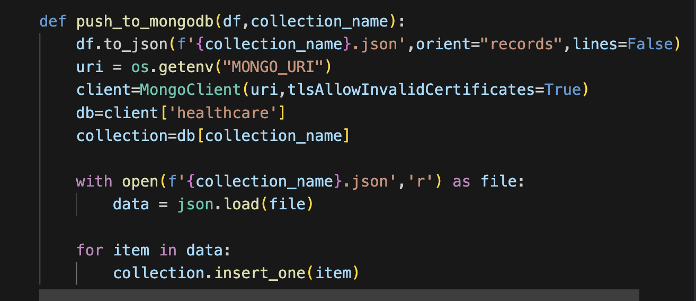

### Medallion Architecture in MongoDB

* **Bronze Layer** : In this layer the raw CSV data is stored as JSON in a MongoDB Collection named heart_disease_bronze in a database named healthcare
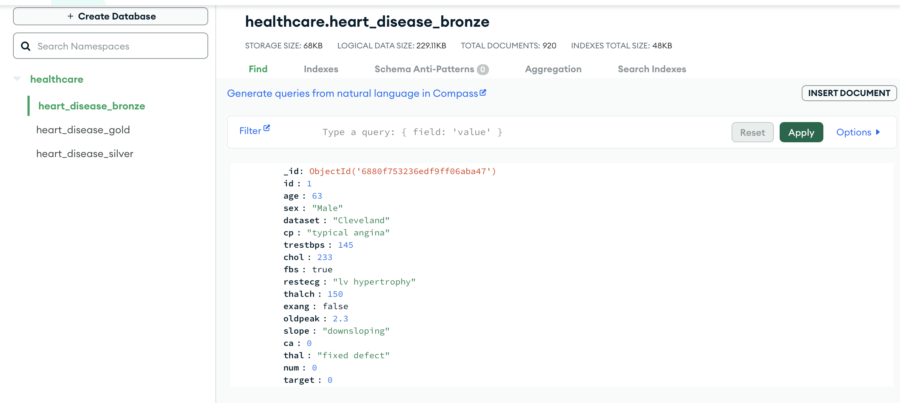
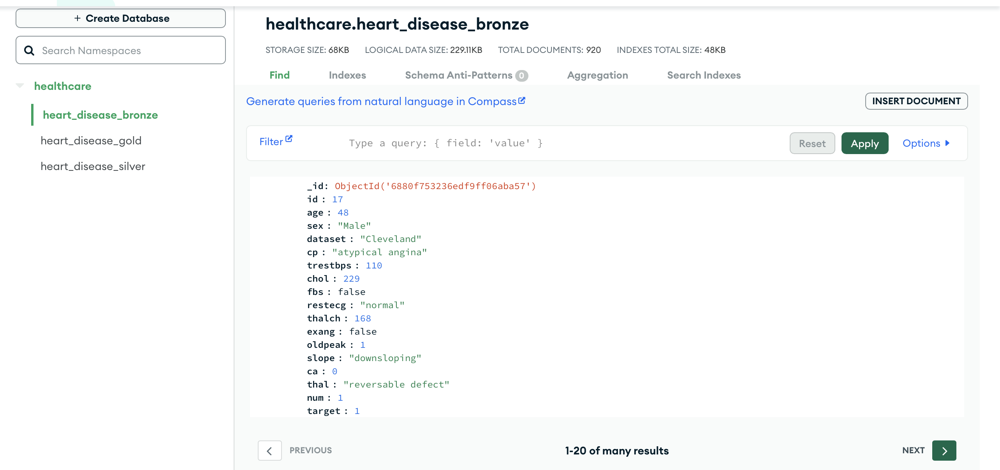
* **Silver Layer** : In this layer, basic preprocessing of data like handling missing values and converting categorical features to numerical encodings is handled. For numerical columns, I used median imputation and for categorical columns, I used mode imputation. The processed data is stored as JSON in a MongoDB Collection named heart_disease_silver in a database named healthcare
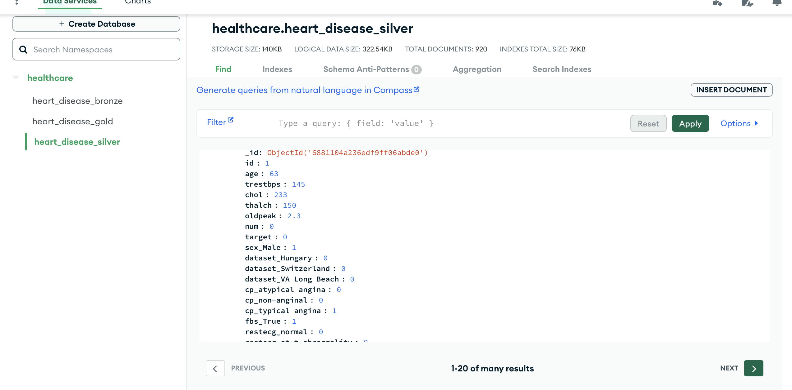
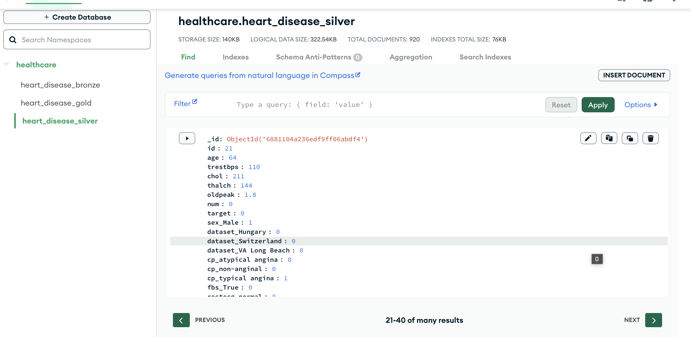

* **Gold Layer** : Data is further processed in this layer.Numerical features are normalized using min-max scaling and irrelevant columns are dropped.Important features are selected based on correlation.

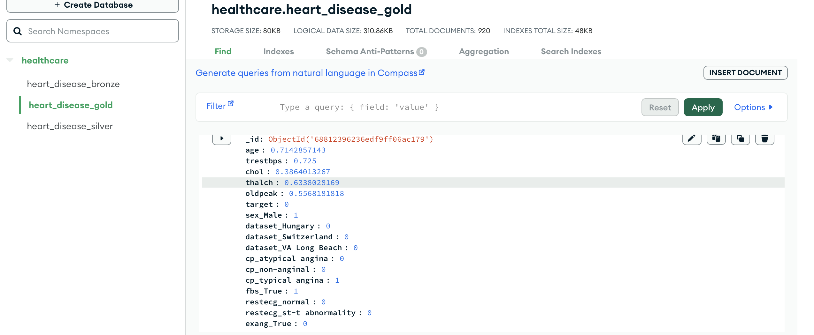
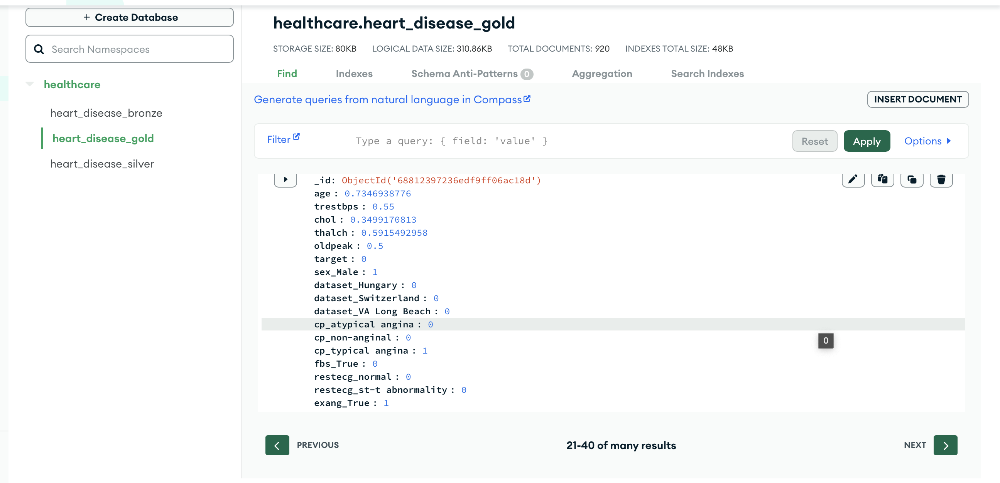

### Machine Learning Model Development
* Added a target column based on the condition that if num>0 then 1 else 0
* For feature selection, I used correlation matrix
  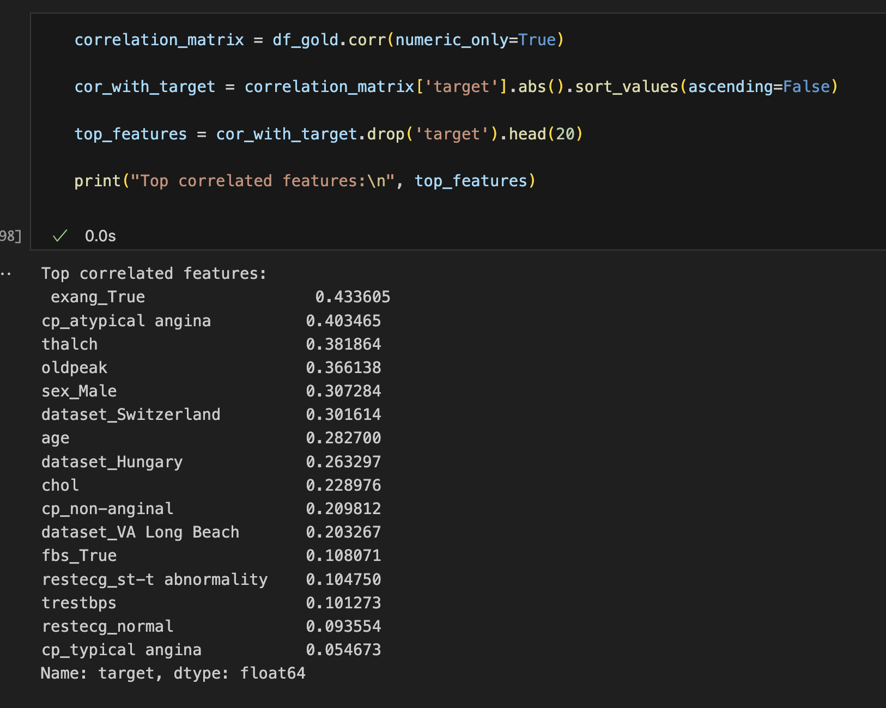
* I chose features based on the condition: correlation>=0.1 and it should not be a region (to avoid bias during training)
* Split the data into training and test (80% train and 20% test)
* Trained different models and finally random forest gave the best results

#### SVM Classifier Results
* 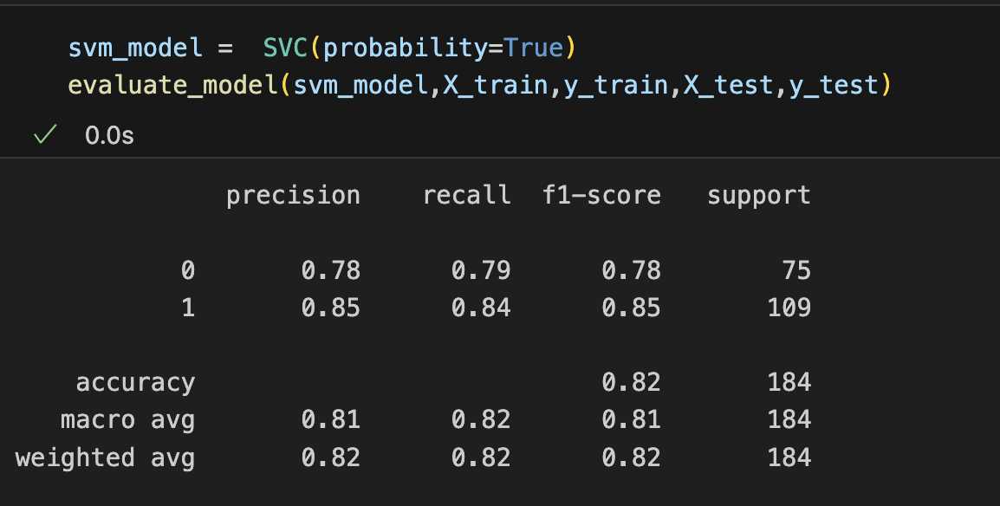
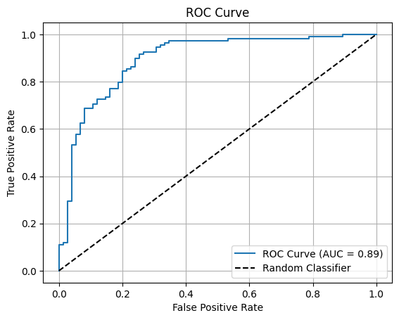

#### Logistic Regression Results
* 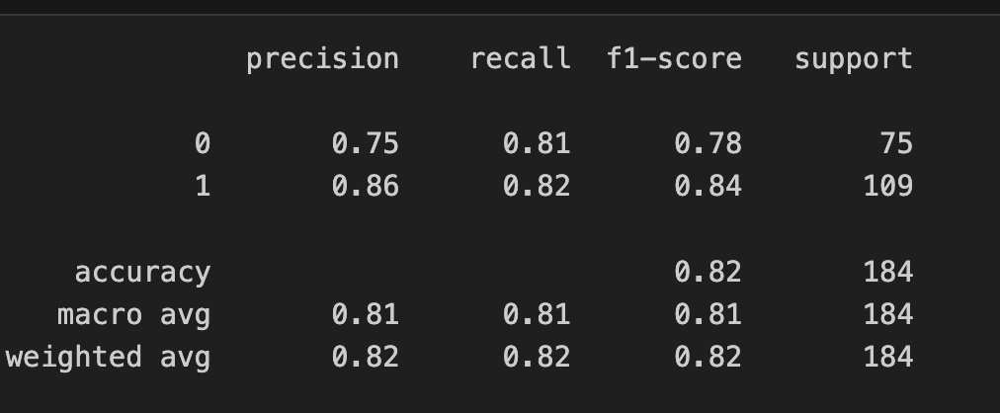

#### Adaboost Classifier Results
* 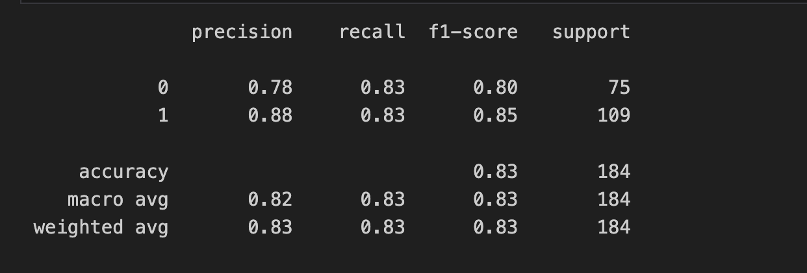
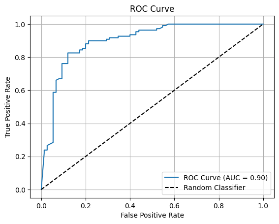

#### Random Forest Classifier Results
* 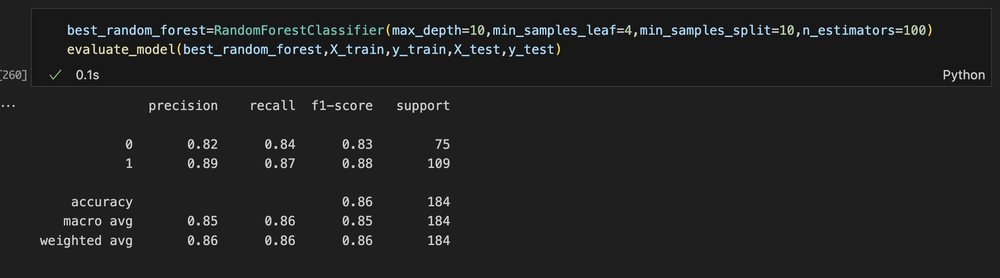
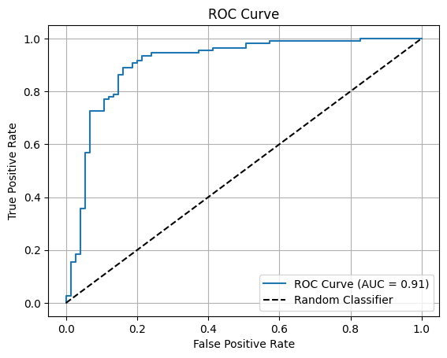

#### Hyperparameter tuning
* 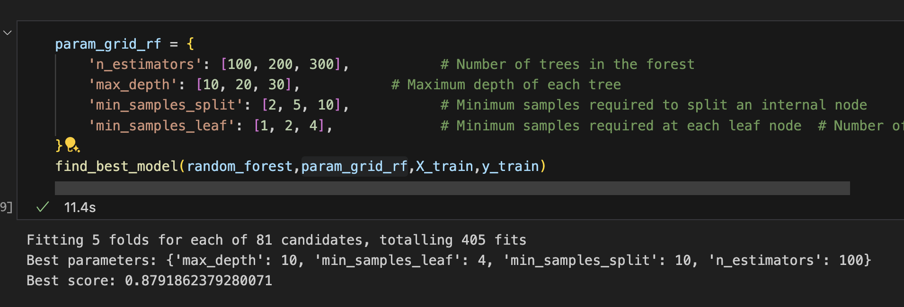
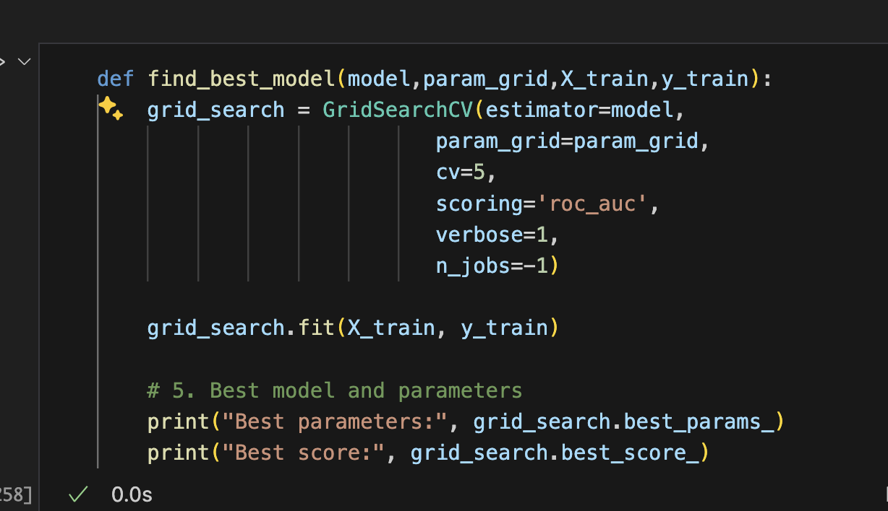

* The best model was found using grid search. It's a brute force method that tries all the combinations of hyperparameters and finds the best combination that gives the best score (roc_auc in our case)

#### Why Random Forest performs best
* Random forest is an ensemble of decision trees.
* Individual decision trees might overfit the data, but aggregating the results from many trees, reduces overfitting.
* Random forests are trained on different subsets of data via bootstrapping, which helps in generalization.
* Each tree in random forest splits based on a threshold and not based on distances which in turn makes random forest robust to outliers
* It works well with non linear features

### API Documentation
* **Endpoint** /health
**Description**: Checks API status and returns 200 OK if running
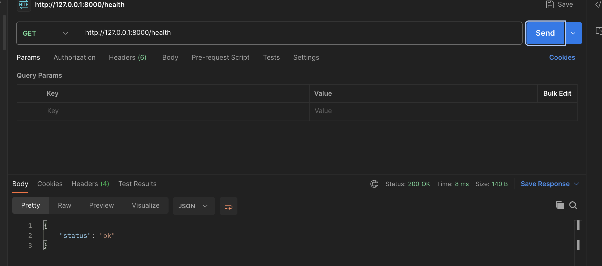
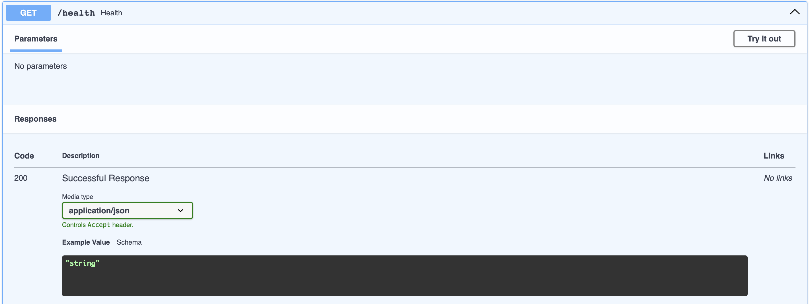
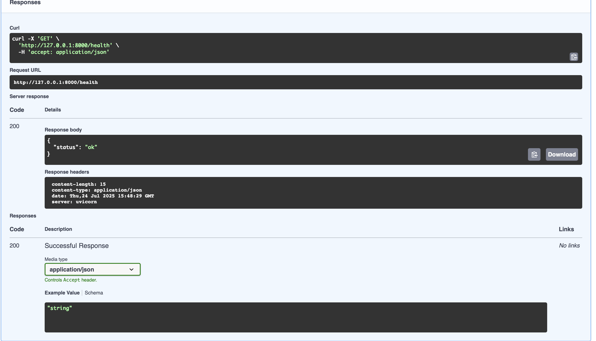

* **Endpoint** /predict
**Description**:  Accept patient data (e.g., age, sex, cholesterol) as JSON and return the presence of heart disease
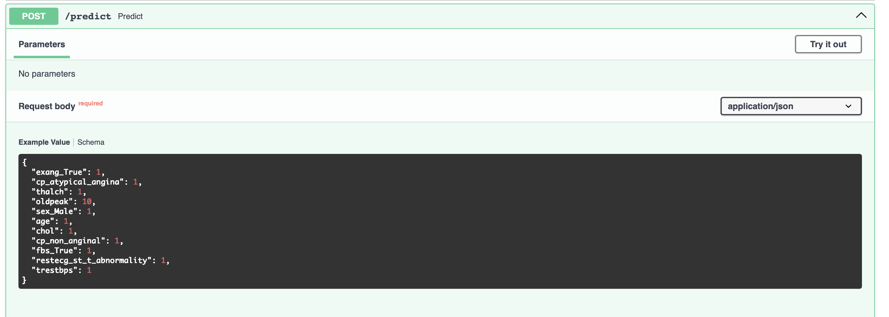
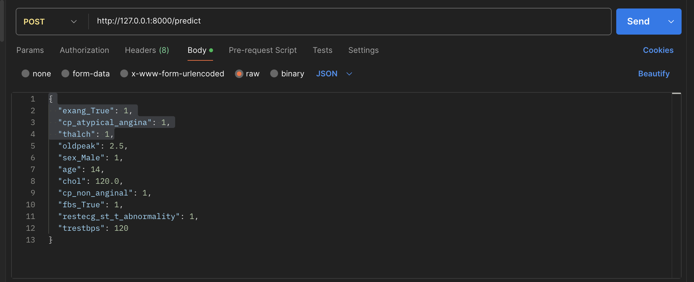
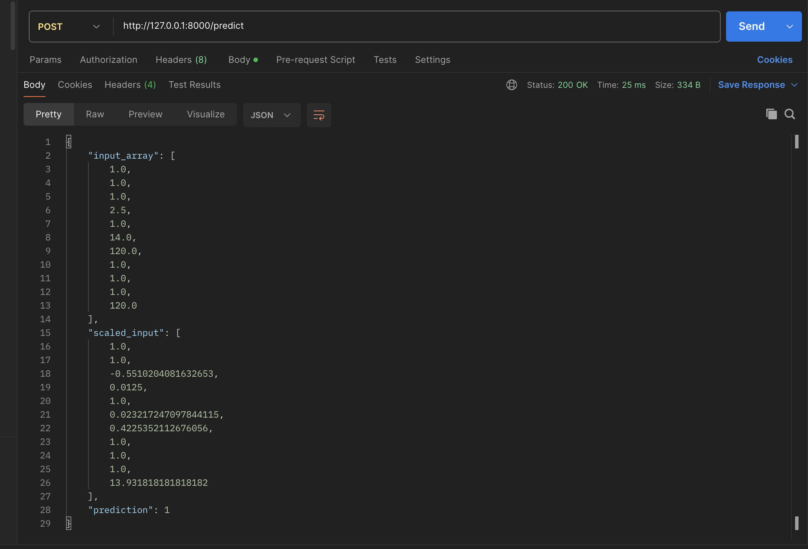

### Render URL
* https://heart-disease-prediction-id2i.onrender.com
